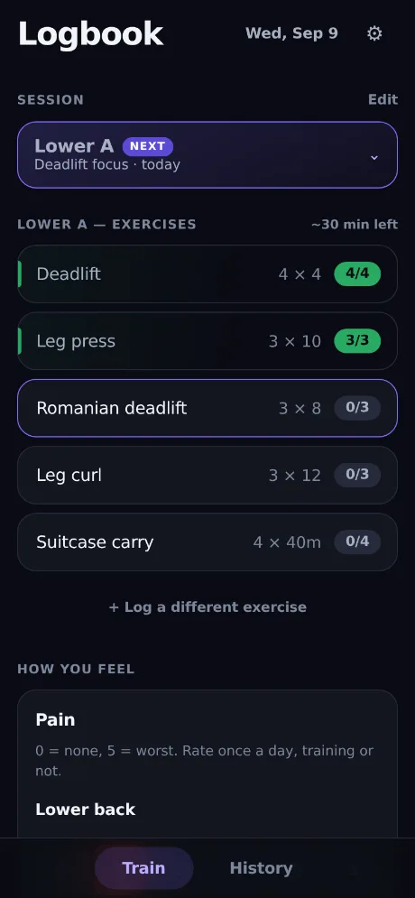
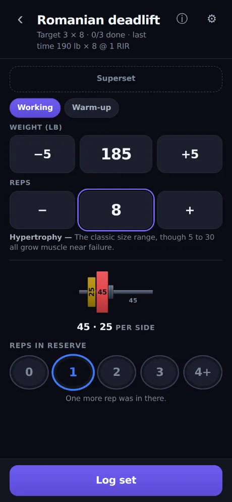
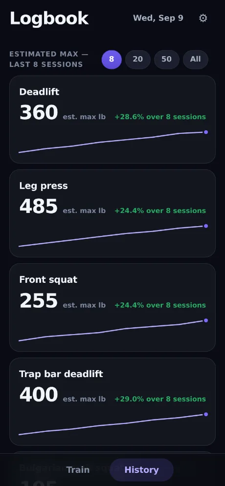
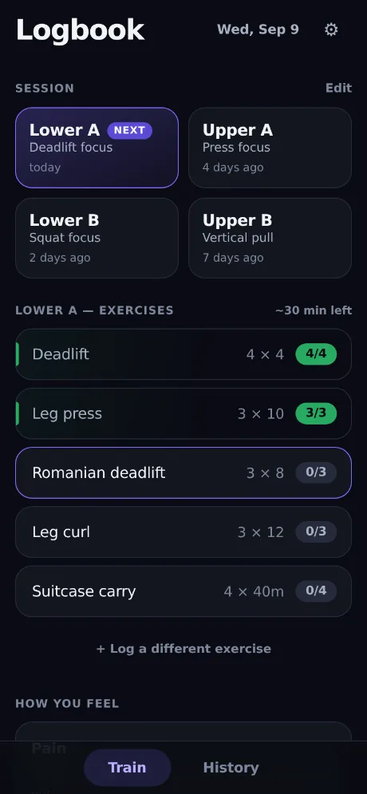
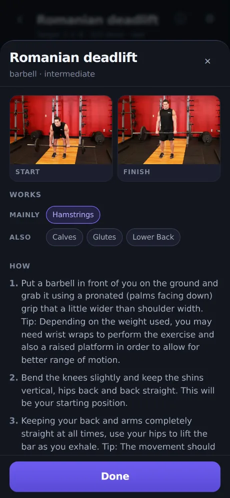
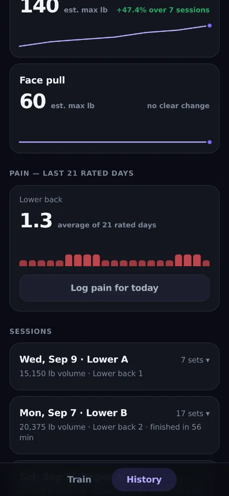

# Logbook

A lifting logbook that works with no signal, in a gym, on a phone that is
face-down between sets. Sets, plate math, a rest timer, superset pairing and
pain tracking by site. Data lives in the browser on your device — nothing is
uploaded anywhere.

**[Open the app](https://hype-armor.github.io/WorkoutLogBook/)** · [Add it to your home screen](#install-it) ·
[How it is built and shipped](docs/development.md)

| Train | Log a set | History |
| :---: | :---: | :---: |
|  |  |  |
| Where you are in the session, and what is left of it | Weight, reps, and how close to failure | What the work added up to |

Screens are a seeded example log, not real training.

## What it is

One `index.html` — markup, styles and logic in a single file — with a service
worker that precaches it. There is no account, no server and no sync. Open the
file straight from disk and it works; serve it over HTTP and it installs to a
home screen and opens full-screen with the network off.

Everything below is what the app does and, mostly, why: the rules it applies to
your numbers are opinionated, and an opinion you cannot see is just a surprise.

## Install it

Open **https://hype-armor.github.io/WorkoutLogBook/**
on the phone, then use the browser's *Add to Home Screen*. After that it
launches full-screen and works offline, including the exercise photos.

To run your own copy, see [docs/development.md](docs/development.md).

## Estimated max

Built only from sets taken to 2 reps in reserve or harder, and shown rounded to
the smallest jump your plates allow.

Both rules exist for the same reason. Reps in reserve is added to reps in the
Epley formula, so a set left further from failure scores *higher* — the same
weight for the same reps read as a smaller max once you reported working
harder, and `4+`, the least precise point on the scale, produced the highest
number of all. Past 2 RIR the estimate was moving on how you rated the set
rather than on what you lifted.

Rounding follows the rack because that is the real resolution: with 2.5s the
step is 5, with 1.25s it is 2.5. The rounding happens once, where the series is
built, so the number on the card, the percentage beside it and the line under it
all describe the same values.

For a bodyweight lift the figure is what you could **add**, not you plus it — a
set of unweighted dips reporting "195 lb" read as a barbell number with nothing
on the belt. The bodyweight it uses is the one you were on *that* date, not the
one you are now; see below.

A card whose sessions did not all qualify says so: `1 of 2 sessions counted`
rather than `first session`, which contradicted the rows listed underneath it.

## Bodyweight

A dated series, not a setting. It used to be one number applied to every set
ever logged, which meant the effective load of a pull-up done in January was
computed from what you weigh today: step on a scale and the whole dip and
pull-up history re-rated itself, trend and volume together. Losing ten pounds
read as getting weaker.

Each set is now scored against the weight in force on its own date — the most
recent reading on or before it. A set logged before the first reading has no
honest answer and takes the earliest one, which is the least-wrong option rather
than a good one.

Two readings and it is also a chart, beside the estimated-max cards. It is the
one number there that moves for reasons other than training, which is why it is
worth seeing next to the ones that do not — and why it is not coloured as
progress in either direction.

## Sets per muscle

The guide already knew which muscles each exercise works and every working set
was already dated; nothing joined the two. So the app could report that a
deadlift estimate was up 10.7% over eight sessions and could not report that two
direct hamstring sets had been done in a fortnight.

History now counts working sets per muscle over the last seven days. Primary and
secondary are counted **apart**, never summed: a Romanian deadlift is a hamstring
set and is not a calf set, and adding them would say it was. No target is named
— the usual ten-to-twenty is a range with wide individual variation, and this
reports what you did.

Anything the guide does not know — every exercise you add yourself — is counted
and named rather than dropped. A chart that quietly ignores a third of the work
is worse than no chart.

## Warming up

For a barbell lift with a working weight entered, a suggested ramp sits under
the Working/Warm-up toggle: the empty bar, then roughly 40%, 60% and 80%, each
rounded to what your rack can actually make. Tapping one logs it as a warm-up
without touching the weight in the field, which is the working set you are
ramping towards. Steps you have already done drop off, and the whole row goes
once the work starts.

Rounding is also what thins the list on a light lift: two steps that land on the
same loadable number collapse into one. A ramp is lifting convention rather than
a finding, and this is here to save taps on something you were going to do
anyway.

## Which session is next

The app opens on one session out of four, and which one it opens on used to be
left to be inferred. It says it now: the one that is up carries a **Next** pill,
and every day in the picker says how long since you last did it — `9 days ago`,
`2 days ago`, `not done yet` — which is the evidence for the claim and the thing
that shows when the rotation on screen has stopped matching the week you had.

Collapsed, the chip is the whole answer to "what am I doing today", so when the
session it is showing is *not* the one that is up — you went to look at another,
or stayed on one you have finished — it says which one is instead of repeating
the day's tag: `Upper B is next`.

A session under way is itself the one that is up; the rotation must not step out
from under you mid-workout. Finishing hands it on, and the chip says so while the
screen stays on what you just did.

## When the day on screen is not the day you did

The day the app opens on is a guess: the one after whatever you logged last. It
is wrong whenever you skip one or take them out of order, and the cost of that
is not cosmetic. Every set is stamped with the day it was logged under, and the
target it is judged against — for the count badge, for whether the weight goes
up next time — is read back out of that stamp. A session logged under the wrong
day sits in a list of `Not in Upper A` rows with no targets at all.

Two things now catch it. The exercise picker names the day each exercise belongs
to, not only the ones on the day you are already on — saying it just for this
day left everything else looking like it belonged nowhere, so picking it read as
the way to log it. And once another day of your program covers more of the
session than the day on screen does, an offer appears directly above the rows
that are the evidence: *This looks like Upper B, not Lower A* — **Switch**.

Switching moves the session and re-stamps the work, so the targets fill in and
the weights progress from the right prescription. One lift borrowed from another
day stays a substitution: the offer needs the other day to cover strictly more
of the session than this one does.

A `Not in` row belongs to the session it was logged in, which is the day stamped
on each set — not merely the date. Going by date alone, today's work appeared
under all four days at once: switch to another day to look at it and there was
today's session again, filed as `Not in` a day it was never logged against. The
data was right and the reading of it was wrong, so nothing needed deleting.

Scoring works the same way. A day is judged by what was logged *under it*, so a
stray lift under one day is not told to join whatever session was loudest that
date. And with no `Not in` rows on screen there is no offer at all: without them
it is not a misfiled session, it is you looking at another day, and being told to
switch back is a nag.

The very first version of the app did not record the day. Where one set of a
date carries it and its neighbours do not, migration gives them the commonest
stamp on that date — they were the same session. A date with nothing stamped
anywhere is left alone and still shows everywhere, because there is nothing
better to say about it.

Logged by mistake is the other way a `Not in` row appears, and it used to be a
one-way door: the row is not in the program, so the program editor's controls
never applied to it. Under **Edit** each one now has a **×** that removes
everything logged under it that day, warm-ups included, with an Undo that puts
the sets back at the indices they came from — which session is up is read off
the last set in the list, so the order is not decoration. The control lives
behind Edit rather than under a thumb mid-session, because these rows are
legitimately used for substitutions.

## Machines that take weight off

An assisted pull-up or dip machine does not add load, it removes it, so its
weight is a negative number: `−40` is forty pounds of help, and the set reads
`BW−40 × 8`. Turn it on per exercise, under **The machine can assist** in that
exercise's settings. Everywhere else the field still refuses a minus sign,
because on a squat that is a typo worth catching.

The sign is the only thing that changes; the rest already pointed the right way.
Progression still adds, so `−40` becomes `−35` — less help next time. The
estimated max is still what you could add to yourself, which for an assisted
lift is a negative number climbing towards zero, and the trend reads that as
progress rather than decline. Volume counts the load you actually moved:
180 lb of lifter with 40 taken off is 140, not 220 and not −40.

Two floors keep it honest. The field stops at your bodyweight, because being
helped with more than you weigh is not a set; and a load that still comes out
below zero — bodyweight is editable after the fact — counts as no work rather
than as work subtracted.

The iOS number pad has no minus key, so on a phone the `−` stepper is the only
way below zero. It crosses zero rather than stopping at it, and holding it
repeats, so `−40` is a second's press rather than eight taps.

## The exercise guide

The ⓘ on the exercise screen opens two photos — start and finish — with the
muscles worked and the steps. The photos and steps come from
[free-exercise-db](https://github.com/yuhonas/free-exercise-db), released under
the Unlicense (public domain), resized to 560px WebP: 44 files, about 830KB.
Two exercises have no exact photo in that set and show the nearest match, and
say so — a suitcase carry is shown by a farmer's walk, a Bulgarian split squat
by a plain split squat. The button is hidden for exercises the guide does not
know, which includes anything you add yourself.

The photos are precached, so the guide works in a gym with no signal, but in a
cache of their own: an app release purges the previous app cache and would
otherwise re-download 830KB of photos that had not changed. `MEDIA_VERSION` in
`sw.js` is bumped by hand when they do.

## Finishing an exercise

The set that completes a target does not start a rest timer — there is no next
set to rest for. In the timer's place a panel names what you just finished and
what comes next, with a button that takes you there: the next unfinished
exercise below this one, wrapping to the top only once nothing is left
underneath. On the last one it offers the way back to the list instead.

## Rep ranges

Under the reps field the app names what that count usually trains: 1–5 strength,
6–15 size, 16–30 endurance, past 30 a very long set. The cut points follow load —
5 reps is about 87% of a one-rep max, 15 about 65%, 30 about 50%.

The copy is deliberately hedged, because the evidence is softer than the usual
chart. Heavy low reps are the *best* way to raise a one-rep max, not the only
thing that builds strength. Muscle grows anywhere above roughly 30% of your max —
a rep count past 50 — provided the set is taken near failure, so "5 to 30" is a
practical convention rather than a finding. Whether high reps are specifically
better for endurance is the weakest claim on the chart; the review that
re-examined the repetition continuum calls it equivocal, hence "probably".

High reps are not cardio. That is a different session, not a rep count.

Every rendered line must stay under 92 characters: that is where it wraps to a
third row at 375px and the block starts jumping under your thumb. A test asserts
the height is identical across all four bands and the blank state.

## When the weight goes up

A session earns the next weight by being completed at the one it used: every
prescribed set, every prescribed rep, and nothing taken to failure. Fall short
of any of those and the same weight comes back, with the sheet saying which —
`repeating — 3 of 4 sets`, `short of 4 reps`, `a set went to failure`. RIR 0 is
failure by definition, wherever in the session it happened.

Adding load to a session you could not finish is how a lift stalls for a month.
So is repeating one. After three held sessions in a row the app stops offering
the same number and backs off about 10%, rounded to the plates, saying
`stalled 3 sessions — backing off 10%` instead of the reason for the hundredth
time. Three and ten percent are conventions, not findings; they are there to
break a loop rather than to be precise about it. Nothing to take off — an
unweighted bodyweight lift — is not called a deload.

## How long it will take

The exercise list carries an estimate of what is left of the day. It is not a
rest-plus-guess model: the interval stored on every set is the whole gap from
the previous set to it — the rest and the set itself together — so the lifting
time is already inside the numbers the app has recorded. The estimate is the
median of your own intervals for each exercise, times the sets you have left.

An exercise with fewer than three recorded intervals falls back to its rest
target plus the median amount by which your sets run over their rest, which is
as close as the log comes to measuring setup and lifting on their own. With no
history at all it is the rest target plus 45 seconds.

Medians rather than means, over intervals clamped to between 15 seconds and 15
minutes: a phone call in the middle of a session should not teach the app that
your sets take two hours.

Once the session is finished the same spot reports what it actually took, from
the first set to the moment you tapped Finish. History reads the same helper,
so the two cannot drift apart.

It shows nothing only when there is nothing to say — every target met but the
session still open, or a day whose targets carry no set count (`max` rather
than `3 × max`), since without one there is no way to know how many sets are
coming.

## Pain

Rated 0-5 per site, once a day, whether or not you trained — a rest day that
hurts is data. Eleven sites are available; the card shows only the ones you
track, plus any already rated on the day you are looking at, so an old rating
is never hidden from the only control that can edit it. Sites that come in
pairs take an optional left/right tag, which carries forward rather than being
re-answered daily.

History charts one site at a time. Putting a knee and a lower back on the same
strip would imply a relationship the data does not carry.

Six levels rather than eleven: the whole scale fits one row, and nobody can
tell a 6 from a 7 about their own back. Ratings written on the old 0-10 scale
are halved on load, once — the migration is gated on the stored version, since
every 0-5 rating is also a valid 0-10 one.

## Themes

Eight, under **Settings → Theme**: Midnight (the default), Retro, Coffee, Cute,
Cartoon, Neon, Newsprint and Contrast. A theme is nothing but a second set of
values for the same tokens, so
nothing in the app knows one exists — which is also why each carries a *full*
set. A token left out falls back to Midnight's value, and that is not a subtle
failure: it left a near-black tab bar under a cream app.

Every palette is checked the way the default was, at 4.5:1 — ink on each
surface, the label on a filled button, the reps-in-reserve discs, which print
their hues as text. A test reads the live values back out of the stylesheet and
re-runs those pairs on all eight, so a forgotten token fails the build rather
than the eye.

**Contrast** is the exception, and barely a look: pure black, white ink, one
signal colour, and borders heavy enough to find in direct sun. It promises 7:1
rather than 4.5, so the same test holds it to 7:1.

The plate diagram is deliberately **not** themed. A 45 is red in every gym, and
that drawing is a picture of the bar in front of you rather than a chart.

The choice is read in the document head, before the stylesheet has finished
parsing, because the data load is asynchronous and waiting for it flashes the
dark app on the way to a cream one. It is also what the browser is told to paint
behind the status bar; left alone, a cream app keeps a near-black notch.

## Zooming

Turned off, deliberately, and it takes three separate mechanisms because no one
of them covers a phone on its own:

- `user-scalable=no, maximum-scale=1` in the viewport — which Chrome and Android
  honour and **iOS Safari has ignored for page zoom since iOS 10**.
- `touch-action: pan-x pan-y`, which leaves panning and drops both pinch and the
  double tap. The rule was `manipulation` before, which drops only the double
  tap; pinch went straight through it.
- Cancelling Safari's own `gesturestart`, `gesturechange` and `gestureend`,
  which is the only thing that actually stops it on an iPhone. All three, not
  just the first: preventing the start still lets a pinch already under way
  through. Multi-touch on `touchmove` is deliberately left alone — two fingers
  is also how a phone scrolls.

The fourth kind of zoom is the one you notice most, and none of the above
touches it: iOS magnifies the page to meet the caret when a focused field is
under 16px. The text inputs, textareas and selects were 15px and are 16px now.

The honest note: this fails WCAG 1.4.4, and a test in the suite used to assert
the opposite for that reason. It is a deliberate trade for an app used one-handed
mid-set, where an accidental pinch leaves you lost on a magnified screen with a
bar waiting. Body text is 16px and the numbers that matter are 26px, so the
browser's own text-size control still has room to work.

## Your data

Stored in `localStorage` under `logbook-v1`, on the device only. The app asks
the browser to mark that storage permanent so it is not evicted under storage
pressure — Settings reports whether the request was granted — but the grant is
the browser's to give, and clearing site data erases everything regardless.

So it still nags: after eight sessions without one, a banner offers a backup.
**Settings → Download backup (JSON)** round-trips through **Restore from
backup**. The CSV export is for spreadsheets and does not restore.

Where the browser can share a file — which on a phone means the iOS share sheet
— **Send backup somewhere safe** puts the same JSON into Files, iCloud Drive or
a message. A download never leaves the device, and losing the device is the one
failure a local backup does not cover.

**Restore merges; it does not replace.** It used to overwrite the only copy of
the data, which made the moment you most want it — you have just reinstalled, or
something looks wrong — the moment a month-old file silently took out everything
logged since, with no undo. Sets carry a stable id, so the union is well defined:
anything the backup has and the device does not is added, anything both have is
left alone, and anything only the device has is kept. It reports both halves,
because a merge that says nothing is as unnerving as a replace that says
everything.

If a device blocks storage (private mode, a full disk), a banner says so
instead of failing quietly.

## Built like this

Markup, styles and logic in one file; a service worker that precaches the shell
and keeps the exercise photos in a cache of their own; 265 Playwright tests that
read real bounding boxes at phone sizes; and Release Please, which tags the
version and rewrites it in `sw.js` — the thing that makes an installed phone
notice a release at all. The deploy refuses to publish a build the suite rejects.

The whole of it is in **[docs/development.md](docs/development.md)**: the file
layout, running it locally, the test suite, the release path, the repository
settings that have to be set by hand, and how merges are gated on the tests.
